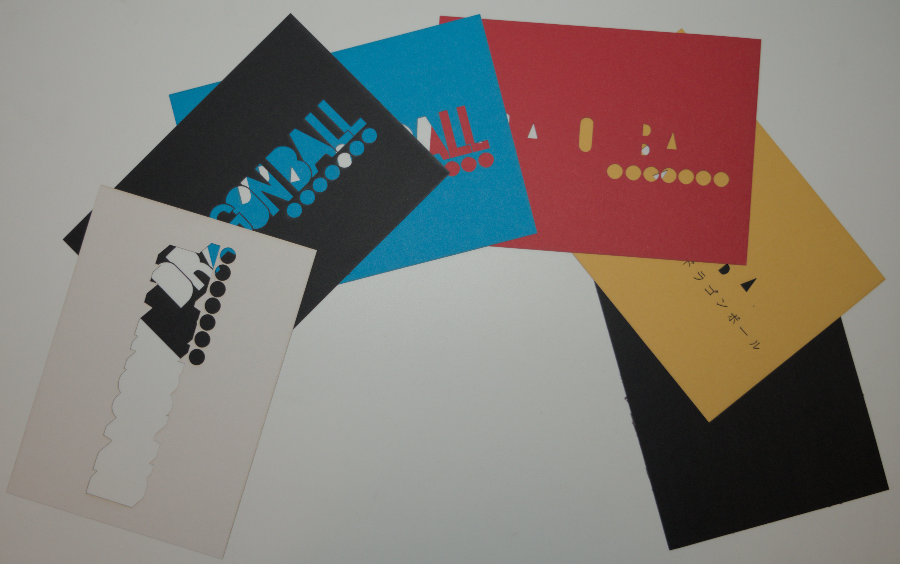
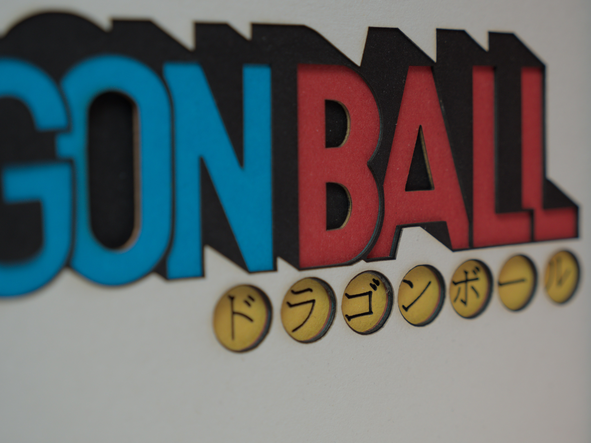
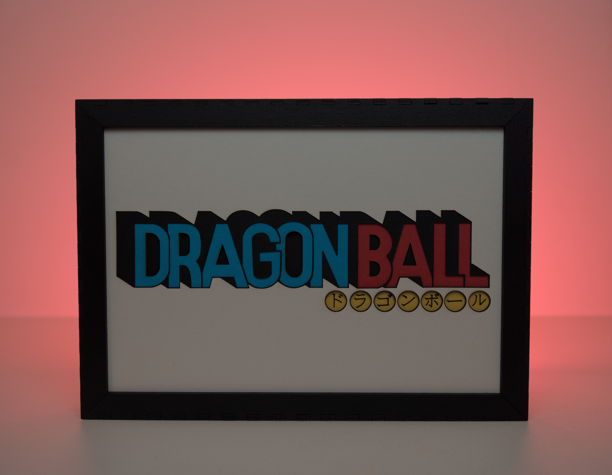

import Section from "../../components/common/Section.astro";
import Youtube from "../../components/common/Youtube.astro";

<Section type="intro" class="">
  
    L'idée m'est venue en regardant un théâtre de papier japonais.    
    Ayant déja fait des logos en superposition de sticker vinyle,    
    j'avais le process en tête et un carnet de feuille de papier de 300gr/m2, de couleurs differentes, donc pourquoi pas tester !
  
</Section>
{/* intro */}
<Section type="step">
## 1ère étape: Le découpage par couleur

Après avoir trouvé un logo qui me plait, je le vectorise.  
Ensuite je fais un calque par couleur.  
Pour finir, je passe ces calques a la decoupe laser.

<Youtube id="9AkvVqjAaHs" title="Cadre dragon ball decoupe" />

</Section>
<Section>
## 2ième étape: Le cadre

J'ai trouvé un design de cadre qui me convenais sur [Boxes.py](https://boxes.hackerspace-bamberg.de/ "Boxes.py contient plein de template de boites mais pas que").  
Je l'ai ensuite découpé au laser puis peint à la bombe noire après assemblage.

</Section>
<Section>
## Dernière étape: L'assemblage

Avec toutes les pièces reunies, plus qu'à assembler !

</Section>
